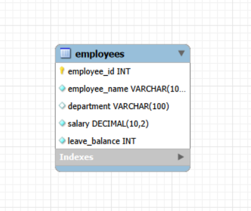

# Simple HR Database - ACID Properties Demonstration

This repository contains a streamlined MySQL demonstration script and Entity-Relationship (ER) diagrams designed to clearly illustrate the core concepts of **ACID properties (Atomicity, Consistency, Isolation, Durability)** using an HR context.

---

## Database Architecture & ER Diagrams

This project demonstrates ACID principles using a highly focused database design. Below is the comparison between the simplified single-table schema used in this script and a comprehensive multi-table HR system.

### Option A: Simplified Schema (Used in this script)
Perfect for isolation tests and clean transactional walk-throughs without foreign key complexities.

### Option B: Extended Enterprise Schema (For deeper relationships)

---

## Database Schema Structure

The active script operates on a single highly functional table:
* **`employees`**: Contains complete master fields including `employee_id`, `employee_name`, `department`, `salary`, and `leave_balance`.

---

## ACID Test Scenarios Walkthrough

### Atomicity (All or Nothing)
* **Successful Execution (A1)**: Updates an employee's salary and deducts leave balance together. Both operations succeed and are saved permanently via `COMMIT`.
* **Rollback Execution (A2)**: Simulates a mistake where the second step fails (targeting an invalid ID `999`). The script executes a `ROLLBACK`, ensuring the partial salary change from step one is safely discarded.

### Consistency (Data/Business Integrity)
* **Valid Attempt (C1)**: Deducts leave days only if the employee has enough balance (`leave_balance >= requested_days`), transitioning the database from one valid state to another.
* **Invalid Attempt (C2)**: Prevents business rule violations (e.g., an employee trying to take 20 days off with only 6 days left). The transaction skips the invalid operation, preventing a negative balance.

### Isolation (Concurrence Controls)
* **Scenario**: Two separate HR desk staff modifying or viewing the exact same data simultaneously.
* **Demonstration**: Uses `SET SESSION TRANSACTION ISOLATION LEVEL READ COMMITTED`. Session 2 is restricted from viewing uncommitted salary boosts made in Session 1 until Session 1 executes an explicit `COMMIT`.

###  Durability (Non-volatile Storage)
* **Scenario**: Permanent verification.
* **Demonstration**: Once a salary update receives a `COMMIT`, the data is safely written to disk. The changes survive sudden connection dropouts or database service restarts.

---

##  Full Promotion Business Case
The script concludes with a practical real-world scenario combining multiple updates into a single transaction block during an employee promotion:
1. Salary Increase (`salary`)
2. Department Change (`department`)
3. Additional Leave Grant (`leave_balance`)

If any structural or logic step hits a wall, everything resets immediately back to the pre-promotion state.

---

##  How to Get Started

1. Open **MySQL Workbench** or your terminal SQL client.
2. Load and run sections **1 to 3** from the `hr_acid_examples.sql` file to stand up the sample base.
3. Run the test blocks one by one to see how logs shift.
>  *Reminder: Testing **Isolation** requires you to open **TWO separate connection tabs/windows** side-by-side inside your SQL environment.*
